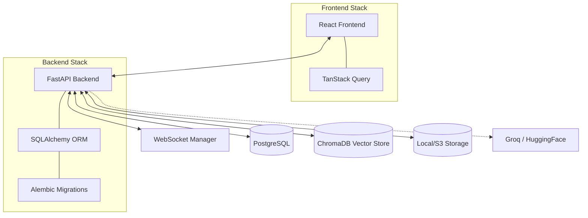
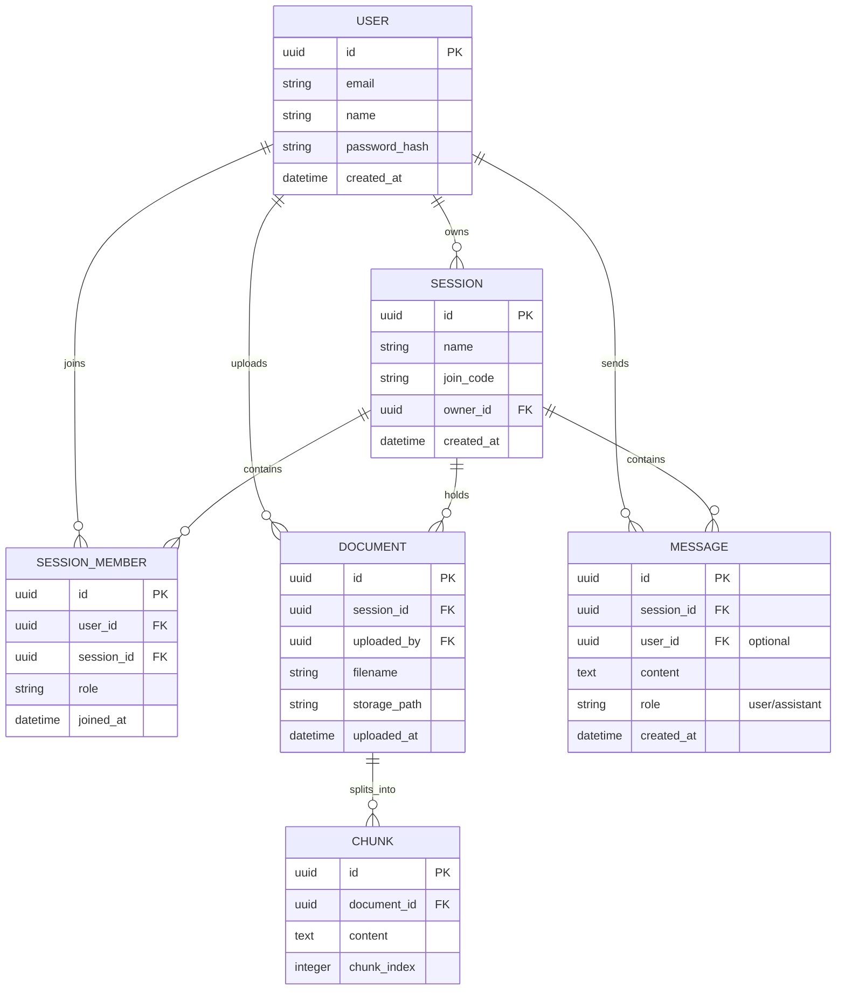

# NYAN-BOT Project Architecture

NYAN-BOT is a collaborative RAG (Retrieval-Augmented Generation) chatbot designed for team-based document analysis and real-time interaction.

## 1. System Overview

The system follows a classic client-server architecture with a clear separation between the frontend UI and the backend API.

## 2. Backend Architecture

The backend is built with **FastAPI**, providing a high-performance, asynchronous API.

### Core Components
- **`app/main.py`**: Entry point, initializes the FastAPI app and includes routers.
- **`app/database.py`**: Connection management for PostgreSQL using SQLAlchemy.
- **[app/models.py](file:///c:/Users/USER/OneDrive/Documents/Major%20Project/nyan/backend/app/models.py)**: SQLAlchemy models defining the relational schema.
- **`app/services/`**: Core logic services including [ChromaStore](file:///c:/Users/USER/OneDrive/Documents/Major%20Project/nyan/backend/app/services/chroma_store.py#8-99) for vector operations and LLM integrations.
- **[app/schemas.py](file:///c:/Users/USER/OneDrive/Documents/Major%20Project/nyan/backend/app/schemas.py)**: Pydantic models for request/response validation and serialization.
- **`app/routers/`**: Categorized API endpoints (Authentication, Sessions, etc.).
- **`app/utils.py`**: Shared helper functions (password hashing, JWT generation).

### Authentication Flow
The system uses **JWT (JSON Web Tokens)** for stateless authentication:
1. User provides credentials to `/api/auth/login`.
2. Backend validates credentials and returns an access token.
3. Frontend stores the token and includes it in the `Authorization: Bearer <token>` header for subsequent requests.

## 3. Frontend Architecture

The frontend is a modern **React SPA** built with **Vite** and **TypeScript**.

### Key Technologies
- **TanStack Query (React Query)**: Handles all server state, caching, synchronization, and error handling.
- **shadcn/ui & Tailwind CSS**: Provides a premium, accessible UI with utility-first styling.
- **React Router**: Manages client-side navigation.
- **Axios**: Configured API client for communicating with the backend.

### Component Structure
- **`src/pages/`**: Main page components (Home, Auth, Chat).
- **`src/components/`**: Reusable UI elements (Sidebar, ChatMessage, Dialogs).
- **`src/hooks/`**: Custom hooks for business logic and data fetching.
- **`src/lib/`**: Initialization of libraries like the API client.

## 4. Data Model

The database schema is designed to support multi-user sessions and collaborative document interaction.

## 5. RAG Pipeline

NYAN-BOT uses a Retrieval-Augmented Generation flow:
1. **Ingestion**: PDFs are uploaded to a session.
2. **Chunking**: Documents are split into text segments.
3. **Embedding**: Chunks are converted into vectors using HuggingFace models.
4. **Storage**: Vectors and metadata are stored in **ChromaDB**.
5. **Retrieval**: When a query is made, relevant chunks are retrieved from ChromaDB.
6. **Generation**: The context and user query are sent to **Groq** to generate an answer.

## 6. Real-time Multi-user Support

NYAN-BOT uses **persistent WebSockets** for low-latency collaboration:
- **Backend Service**: A `ConnectionManager` tracks active WebSocket connections per session.
- **Broadcasting**: When a new message is saved or a session is updated, the backend broadcasts a JSON notification to all connected clients in that session.
- **Frontend Hook**: The `useWebSocket` hook manages the connection lifecycle and uses the `useQueryClient` to invalidate relevant caches (`messages`, `sessions`) upon receiving a broadcast.
- **Efficient Updates**: This approach ensures data is only refetched when it actually changes, leveraging React Query's robust caching system.

---
*Created by Antigravity*
