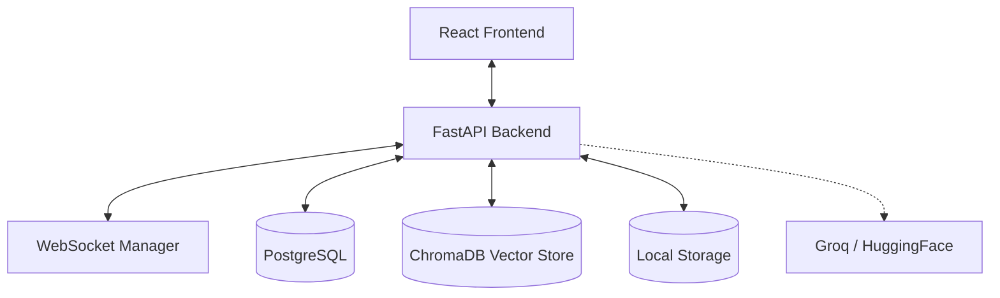
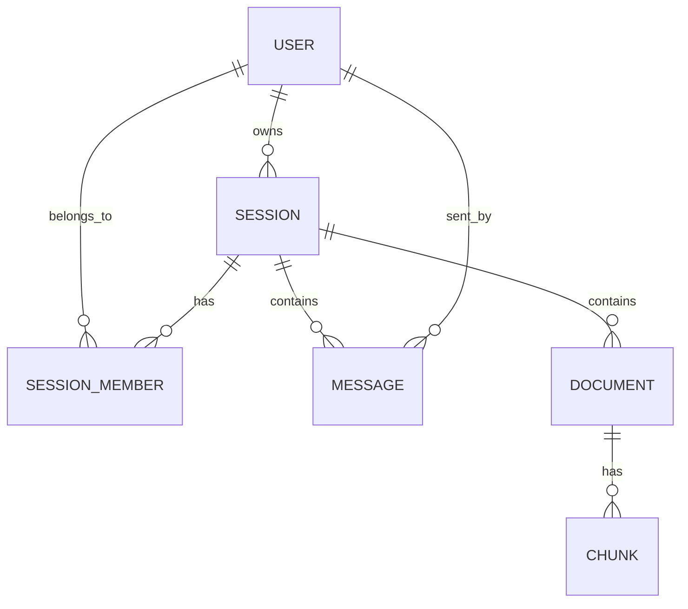

# Project Architecture - NYAN-BOT

NYAN-BOT is a real-time, multi-user RAG (Retrieval-Augmented Generation) chatbot designed for collaborative document analysis.

## 1. System Overview

The system follows a modern client-server architecture with a persistent WebSocket layer for real-time synchronization.

## 2. Backend Architecture (FastAPI)

The backend is built with FastAPI and is structured to handle both synchronous HTTP requests and asynchronous WebSocket events.

### Core Components
- **Routers**: 
    - `auth.py`: JWT-based user authentication and registration.
    - `sessions.py`: Management of chat sessions and members.
    - `messages.py`: Message handling and RAG orchestration.
    - `documents.py`: File upload, parsing, and chunking.
    - `websockets.py`: Persistent connection handling for real-time updates.
- **Services**:
    - `websocket_manager.py`: Tracks active connections per session and handles broadcasting.
    - `chroma_store.py`: Interface for embedding storage and semantic search.
    - `llm_service.py`: Integration with Groq for high-speed AI response generation.
- **Data Layer**:
    - **PostgreSQL**: Stores relational data (Users, Sessions, Messages, Document Metadata).
    - **ChromaDB**: Stores vector embeddings of document chunks for semantic retrieval.

## 3. Frontend Architecture (React)

The frontend is a modern **React SPA** built with **Vite** and **TypeScript**.

### Key Technologies
- **TanStack Query (React Query)**: Handles all server state management and cache synchronization.
- **WebSockets**: Integrated via a custom `useWebSocket` hook for real-time cache invalidation.
- **shadcn/ui & Tailwind CSS**: Provides a premium, accessible UI with utility-first styling.
- **React Router**: Manages client-side navigation.

## 4. RAG Pipeline

NYAN-BOT uses a Retrieval-Augmented Generation flow to answer questions based on uploaded documents:

1. **Ingestion**: PDFs are uploaded, parsed into text, and broken into overlapping chunks.
2. **Embedding**: Chunks are converted into vectors using **HuggingFace** models.
3. **Storage**: Vectors and metadata are stored in **ChromaDB**.
4. **Retrieval**: When a user asks a question, the system searches ChromaDB for the most relevant document chunks.
5. **Augmentation**: The relevant chunks are injected into the LLM prompt as context.
6. **Generation**: **Groq** (llama-3.1-8b) generates a precise answer based on the provided context.

## 5. Data Model

The relational database (PostgreSQL) manages the core entities and their relationships.

## 6. Real-time Multi-user Support

NYAN-BOT uses **persistent WebSockets** for low-latency collaboration:
- **Backend Service**: A `ConnectionManager` tracks active WebSocket connections per session.
- **Broadcasting**: When a new message is saved or a session is updated, the backend broadcasts a JSON notification to all connected clients in that session.
- **Frontend Hook**: The `useWebSocket` hook manages the connection lifecycle and uses the `useQueryClient` to invalidate relevant caches (`messages`, `sessions`) upon receiving a broadcast.
- **Efficient Updates**: This approach ensures data is only refetched when it actually changes, reducing server load.

---
*Last Updated: March 2026*
